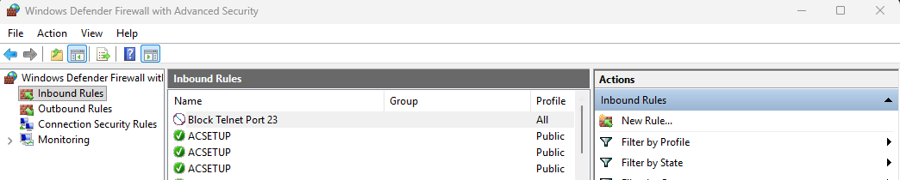
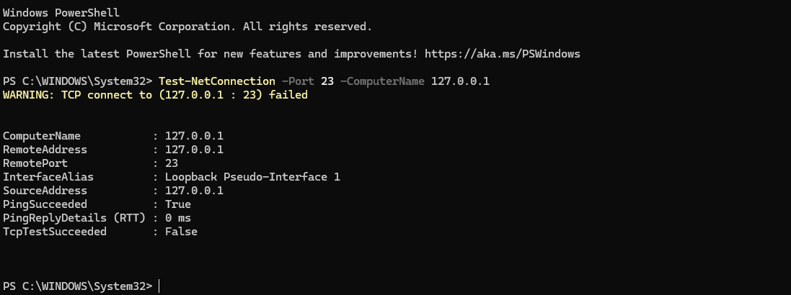
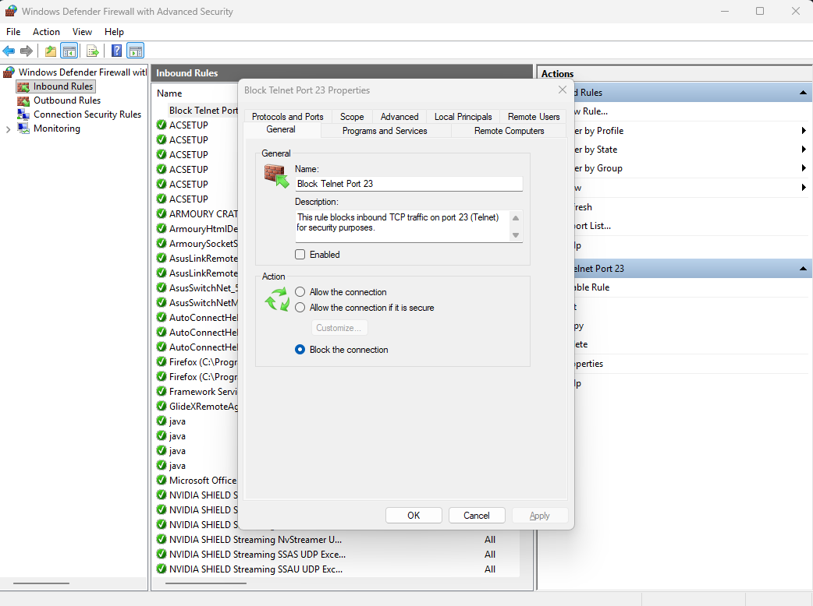

# Task 4 — Setup and Use a Firewall on Windows

# Overview
In this task, I configured and tested basic firewall rules using Windows Defender Firewall with Advanced Security.
The goal was to block inbound traffic on a specific port, verify the block using testing commands, and then restore the system to its previous state.

#Steps Performed:

1. Opened the Firewall Console
Opened Windows Defender Firewall with Advanced Security from the Start Menu.
Viewed Inbound and Outbound rules.

2. Created a New Inbound Rule
Created a Port-based rule.
Protocol selected: TCP
Specific port: 23 (Telnet)
Action: Block the connection
Applied to: Domain, Private, Public
Named the rule: Block Telnet Port 23
----

----
3. Tested the Rule
Used PowerShell to verify if the port was blocked:
'''Test-NetConnection -Port 23 -ComputerName 127.0.0.1'''

4. Disabled the Rule After Testing
Safety step to return system to normal condition.
Right-clicked on Block Telnet Port 23 and selected Disable Rule.

